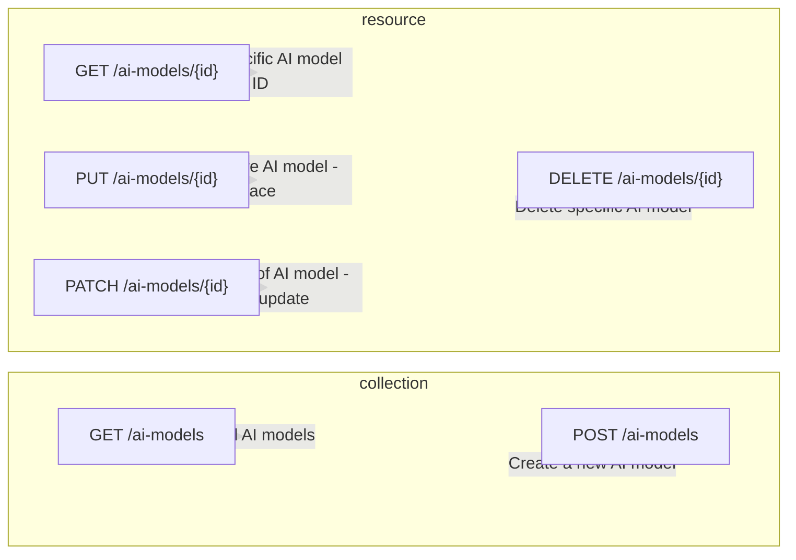

# REST API Design

| HTTP Method | Endpoint             | Description                                   |
|-------------|----------------------|-----------------------------------------------|
| GET         | /ai-models           | Retrieve all AI models                        |
| GET         | /ai-models/{id}      | Retrieve a specific AI model by ID            |
| POST        | /ai-models           | Create a new AI model                         |
| PUT         | /ai-models/{id}      | Update the entire AI model (replace)          |
| PATCH       | /ai-models/{id}      | Update part of the AI model (partial update) |
| DELETE      | /ai-models/{id}      | Delete a specific AI model                    |

 
 

# REST API Design - Diagram

 
 

# Notes

1. Use the appropriate HTTP method for the action.
   - Follow standard HTTP methods for CRUD operations:
     - GET: Retrieve information
     - POST: Create a new resource
     - PUT: Update an entire resource
     - PATCH: Update part of a resource
     - DELETE: Delete a resource

2. The ordering of the HTTP methods.
   - Follow the CRUD sequence:
     1. GET (Read)
     2. POST (Create)
     3. PUT (Update)
     4. PATCH (Update - partial)
     5. DELETE (Delete)

3. Naming the endpoints so that they map the collection.
   - Use clear and consistent endpoint names:
     - Retrieve all: `/ai-models` (GET)
     - Retrieve specific by ID: `/ai-models/{id}` (GET)
     - Create new: `/ai-models` (POST)
     - Update entire: `/ai-models/{id}` (PUT)
     - Update partial: `/ai-models/{id}` (PATCH)
     - Delete specific: `/ai-models/{id}` (DELETE)
