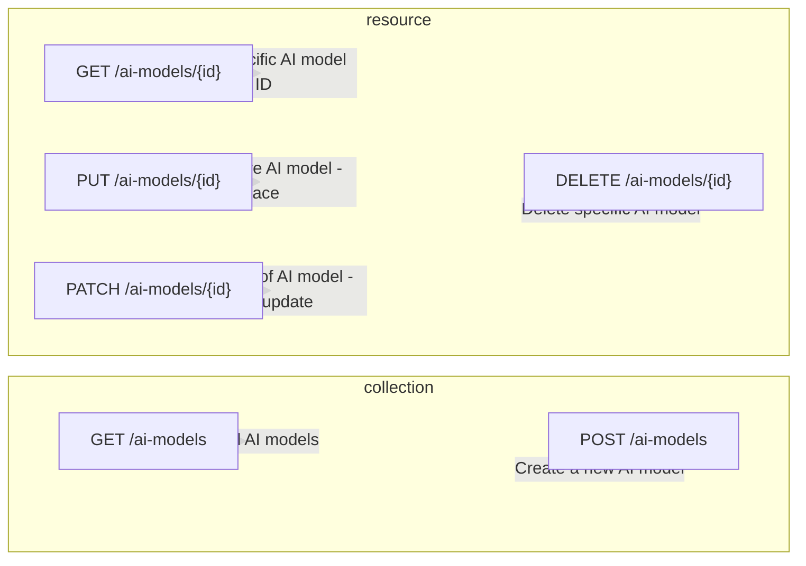

# REST API Design

| HTTP Method | Endpoint             | Description                                   |
|-------------|----------------------|-----------------------------------------------|
| GET         | /ai-models           | Retrieve all AI models                        |
| GET         | /ai-models/{id}      | Retrieve a specific AI model by ID            |
| POST        | /ai-models           | Create a new AI model                         |
| PUT         | /ai-models/{id}      | Update the entire AI model (replace)          |
| PATCH       | /ai-models/{id}      | Update part of the AI model (partial update) |
| DELETE      | /ai-models/{id}      | Delete a specific AI model                    |

 
 
 

# REST API Design - Diagram

